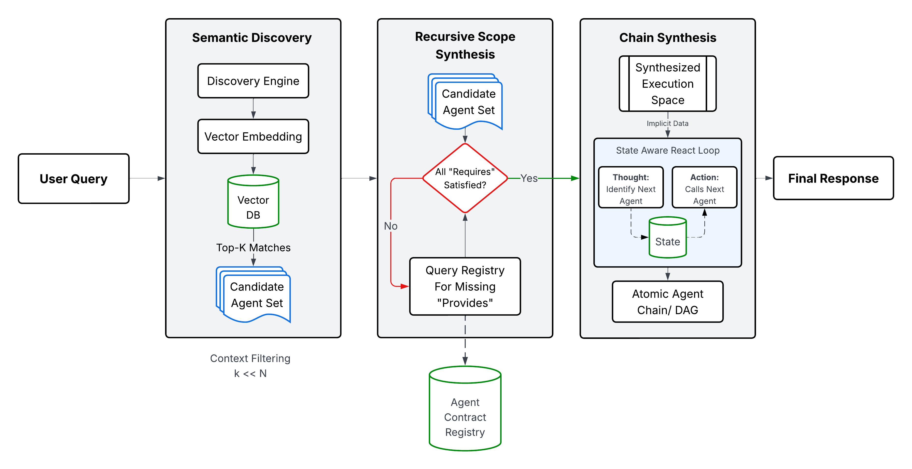

# AgentX (`agent_dist`)

**Distributed Agentic Orchestration Framework with Recursive Execution Space (RES)**

`agent_dist` is a production-grade framework for building, registering, and orchestrating distributed AI agents. It uses **Dynamic Vector Routing (DVR)** and **Recursive Execution Space (RES)** to eliminate context window bloat, enforce dependency correctness, and achieve industrial-scale efficiency across thousands of agents.

> **Peer-Reviewed Research**: The RES framework is formally described and evaluated in *"RES: A Scalable Framework for Robust Multi-Agent Orchestration"* (OpenReview: [STEW5bZ4Zd](https://openreview.net/pdf?id=STEW5bZ4Zd)).

---

## Performance Highlights (v0.2.0)

Rigorously evaluated across a 1,000-agent synthetic clinical ecosystem and the real-world **ToolBench dataset** (16,000 APIs), with all core benchmarks run over **N=30 independent trials** and reported at 95% confidence intervals:

| Metric | Result |
|---|---|
| **Prompt Token Footprint** | Stable at **1,120 ± 145 tokens** (O(k)), vs. ~34,000 tokens for monolithic baseline at 1,000 agents |
| **DVR Retrieval Latency** | **12.5–13.5 ms**, flat from 10 to 1,000 agents |
| **Task Success Rate** | **100%** on structurally valid plans across simple, compound, and deep (14-hop) workflows¹ |
| **Hallucination Rate** | **Near-zero** across Gemini 2.5 Flash, Llama-3-70B, and Llama-3-8B |
| **Recall@5 (ToolBench, 16k APIs)** | **0.82** |
| **MRR (ToolBench, 16k APIs)** | **0.84** |

> ¹ *The 100% task success rate is conditional on plan acceptance. The framework's deterministic halting mechanism rejected 4 of 31 test scenarios due to unresolvable dependency chains, returning a safe explicit error rather than attempting partial execution.*

---

## Features

- **Recursive Execution Space (RES)**: Decouples agent discovery from reasoning for maximum efficiency. Formally proved to converge to a unique Fix-Point Execution Space (see Theorem 1 in the paper).
- **Dynamic Vector Routing (DVR)**: High-precision dense semantic search using transformer embeddings (e.g., `all-MiniLM-L6-v2`) to navigate thousands of agents. Maintains O(k) prompt scaling independent of total registry size N.
- **Contract-Driven Orchestration**: Strict `Requires` and `Provides` data contracts for every agent. Enforces **Contractual Completeness** (Theorem 2) before LLM invocation — no broken or incomplete tool chains ever reach the model.
- **Logical Pruning & State-Aware Planning**: Distinguishes *Implicit Data* (already present in context) from *Explicit Requirements* (must be generated), automatically skipping redundant steps for faster execution.
- **Chain Synthesis**: Generates optimal, executable DAGs (Directed Acyclic Graphs) via topologically sorted agent calls.
- **Atomic Fidelity & Deterministic Halting**: If a contractually complete execution plan cannot be synthesized, the framework halts safely at the routing layer — preventing wasted inference and cascading failures.
- **Human-In-The-Loop (HITL) Oversight**: High-stakes routing decisions surface for human validation before execution, critical for clinical and enterprise deployments.
- **Heartbeat & Liveness**: Real-time tracking of distributed agent health.
- **Built-in SDK**: Rapidly turn any Python function into a contracted, registered agent.
- **Multi-Provider Support**: Seamless integration with OpenAI, Groq, and Ollama.

---

## 📦 Installation

```bash
pip install agent_dist
```

---

## 🛠️ Running Core Services

The framework requires two core services: the **Registry** and the **Orchestrator**.

### 1. Start the Agent Registry
Manages agent contracts, vector embeddings, and recursive dependency resolution.
```bash
python -m agent_dist.registry.app
```

### 2. Start the Orchestrator
The brain of the system. Handles query parsing, scope synthesis, and execution.
```bash
python -m agent_dist.orchestrator.app
```

---

## Defining an Agent
Agents are created using the `@agent` decorator. This handles automatic registration, input schema inference, and contract advertisement.

```python
from agent_dist.agentic_sdk import agent

@agent(
    url="http://localhost:9001/verify",
    name="Insurance_Validator",
    description="Validates insurance coverage and pre-authorization status.",
    tags=["clinical", "billing"],
    capabilities={
        "requires": ["estimated_cost", "mrn"],
        "provides": ["pre_auth_id", "coverage_status"]
    }
)
def verify_insurance(estimated_cost: float, mrn: str):
    return {"pre_auth_id": "AUTH-772", "coverage_status": "Approved"}

if __name__ == "__main__":
    verify_insurance.serve()
```

---

## Architecture & Flow


The system follows a 3-stage pipeline to ensure safety and efficiency:

1. **Semantic Discovery (DVR)**: The user query is embedded and searched against the Registry using dense vector search to produce a candidate set of semantically relevant agents. This reduces prompt context from O(N) to a bounded O(k) footprint, invariant to total registry size.

2. **Recursive Scope Synthesis & Logical Pruning**: The orchestrator recursively crawls the registry to satisfy every unmet dependency in the candidate set's contracts. This process is formally guaranteed to converge to a unique *Fix-Point Execution Space* (Theorem 1). The synthesized scope is cross-referenced with the user query, and agents whose required inputs are already present in context are pruned as redundant.

3. **Chain Synthesis**: The planner generates an optimal DAG of agent calls via topological sort of data dependencies. Contractual Completeness (Theorem 2) guarantees that every step's required inputs will be satisfied by either the user context or an upstream agent before execution begins.

---

## Formal Guarantees

The framework's correctness is grounded in two formally proved theorems:

**Theorem 1 — Fix-Point Execution Space**: The scope expansion function `f` is strictly monotonic on the power set lattice and converges to a unique fixed point `S*` in at most `|A|` iterations, where every agent's input requirements are satisfied. Guaranteed by the Knaster-Tarski theorem.

**Theorem 2 — Contractual Completeness**: If the scope expansion reaches `S*` and the execution plan is topologically sorted, then for every step `m`, its required inputs are guaranteed to be satisfied by either the initial user context or the outputs of preceding steps. This prevents execution on structurally invalid plans.

Both theorems were empirically stress-tested against adversarial graph formations including diamond dependencies, disconnected components, fan-out patterns, and self-loops — all verified successfully.

---

## Evaluation Summary

Benchmarked against three baselines — **Flat-Context (Monolithic)**, **BM25 (Sparse Keyword)**, and **RAG+Rerank (Dense + LLM)** — across registry scales from 10 to 16,000 agents:

- **Token Efficiency**: Monolithic baseline hits ~34,000 tokens at 1,000 agents and exceeds context limits beyond that. RES holds steady at ~1,120 tokens regardless of scale.
- **Retrieval Quality**: At 16,000 real-world APIs (ToolBench), RES achieves Recall@5 = 0.82 and MRR = 0.84. RAG+Rerank fails entirely at this scale due to cross-encoder token limits.
- **Multi-Model Generalizability**: 100% task success and near-zero hallucination maintained across Gemini 2.5 Flash, Llama-3-70B (Groq), and Llama-3-8B (Ollama) in zero-shot mode — demonstrating the gains are architectural, not model-specific.
- **Sub-Goal Completion**: Deep workflows show ~78% sub-goal completion, confirmed via ablation to be intentional LLM optimization (skipping steps whose dependencies are already satisfied in context), not reasoning failure.
- **Context Isolation**: In adversarial tests with 100 semantically similar doppelgänger agents, RES correctly surfaced the right specialist 100% of the time vs. 10% for the monolithic baseline.

---

## Safety & Reliability
- **Sandbox Isolation**: The LLM *cannot* see or call tools that haven't passed the contract-validation phase.
- **Atomic Fidelity**: Every execution plan is verified against the Registry's technical contracts before the first step is taken.
- **Deterministic Halting**: If dependencies cannot be resolved, the framework returns an explicit error at the routing layer rather than attempting partial or incorrect execution.
- **HITL Integration**: Human-In-The-Loop oversight protocols are integrated prior to execution for high-stakes routing decisions, particularly in clinical environments.
- **Step Enforcement**: Maximum step limits and loop detection prevent runaway agent chains.

---

## Memory & Tracing

The framework includes a built-in SQLite-backed memory system for per-session history and deterministic replay.

#### Trace CLI Tool
Inspect execution traces using the `agent-trace` CLI.

```bash
# List recent traces
agent-trace list --limit 10

# Show detailed trace for a session
agent-trace show <session_uuid>
```

---

## ⚙️ Configuration
Configure using `.env` or environment variables:

```bash
LLM_PROVIDER=groq      # groq, openai, or ollama
LLM_MODEL=llama3-70b
LLM_API_KEY=your_key

AGENT_REGISTRY_URL=http://localhost:8000
STRICT_CONTRACT_VALIDATION=true
```

---

## 📖 Citation

If you use this framework in your research, please cite:

```
@article{shekar2025res,
  title={RES: A Scalable Framework for Robust Multi-Agent Orchestration},
  author={Shashi Shekar S},
  journal={OpenReview},
  year={2025},
  url={https://openreview.net/pdf?id=STEW5bZ4Zd}
}
```

---

## 📜 License
MIT License
